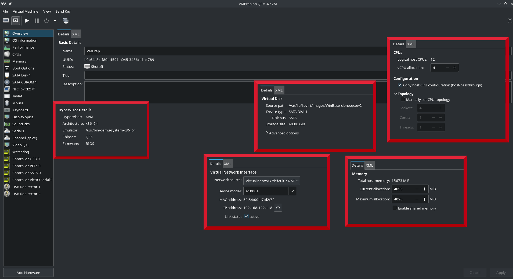

# Walkthrough our VM prep
note that some virtualization technologies here are based on linux such as KVM. However, main concepts still apply in any virtualization emvironment.
 
## Choosen Virtualization Environment 
> - [qemu](https://www.qemu.org/) used as the emulation software  
> - [KVM](https://linux-kvm.org/page/Main_Page) used to accelerate the machines  
> - [libvirt](https://libvirt.org/) for configuration and using [virtmanager](https://virt-manager.org/) as a GUI and [virsh](https://libvirt.org/manpages/virsh.html) for CLI  
 

Standard windows10 Pro installation using its [ISO](https://www.microsoft.com/en-us/software-download/windows10ISO) with the following machine specifications:
> - 40GB virtual disk
> - 4 CPU cores
> - 4GB RAM

 
> note this image was edited to show all specifics
 

## Anti-VM Techniques
techniques we used for SandBox evasion and how we knew about them . note that all code/scripts used in this section can be found in the src directory.  

### [+] Task Manager you little snitch 
When opening the VM's task manager to check how things are going, we notice it detects the virtualization and shows it.  

 

tskmgr invokes **CPUID**, which is an assembly instruction used to fetch CPU information (supported features/architecture/vendor). 
The following video shows a customized C++ code to fetch CPU information retuned by CPUID and what are the right configs to solve this issue.    [Video](https://youtu.be/Fcis8nwagCY) 
> note: this instruction sets bit 31 in ECX to 1 if a hypervisor is present which is what tskmgr checks. code found at ./src/CPUID.cpp

    

    

 

### [+] Your MAC may give it away
most VMs have a special MAC address which can be detected since it doesnt have a real vendor. You can create/generate your own mac in 2 steps
1. choose a vendor, you can find a list of vendors at [ @aallan/mac-vendor.txt](https://gist.github.com/aallan/b4bb86db86079509e6159810ae9bd3e4)
and replace the first 3 bytes of the VMs mac with it.
2. Validate the MAC using [MAC Address Lookup](https://maclookup.app/) to make sure its registered.

A step by step video can be found [here](https://youtu.be/dCTyDEmO53c)

    

    
 

 

### [+] Qemu/VM string is all over the place
using [WMI](https://learn.microsoft.com/en-us/powershell/module/microsoft.powershell.management/get-wmiobject?view=powershell-5.1) you can query the systems classes. some classes contain the string "QEMU" which is the emulator we are using. this is a dead giveaway for virtualization.
to solve this issue we need to modify some regirsty keys.
> used powershell queries can be found in ./src/WMIqueries.ps1

a demo video can be found [here](https://youtu.be/mMQZVk_LMBE)

    

    
 

### [+] Many more
things like process enumeration / File enumeration / Disk Size / Memory Size / screen resolution / Hostname and Username .... 
> soon to upload

 

## Network Setup
how to create an isolated network (AKA hostonly) 

### [+] QEMU isolated network
this [demo](https://youtu.be/Euqa_VjarTM) shows how to create an isolated network, where the machine is pingable only by the host.

  

## Disabling System Protections 

### [+] Firewall? we dont know her
[Demo](https://youtu.be/x_W33sjcSY4) for disabling the firewall  

### [+] Windows Defender
[Demo](https://youtu.be/1WjSDQGBbH8) we are getting rid of that as well. 

  

## Needed tools

### [+] Host shared folder
for this feature we will run [VirtIO-FS](https://virtio-fs.gitlab.io/howto-windows.html) service ,which we are going to [hide](https://www.sans.org/blog/red-team-tactics-hiding-windows-services/) later.
> note to follow the demo you need to install winFPS and virtIO.iso

Demo can be found [here](https://youtu.be/mrRQUE9PXm0)
  

### [+] Debuggers / Disassemblers and more ...
- For that we installed [FlareVM](https://github.com/mandiant/flare-vm/tree/main)

